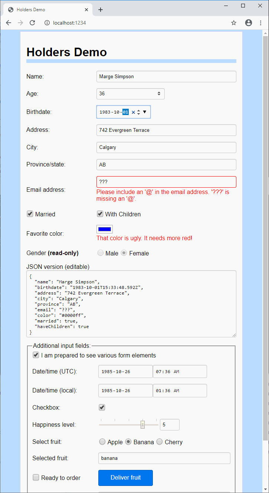
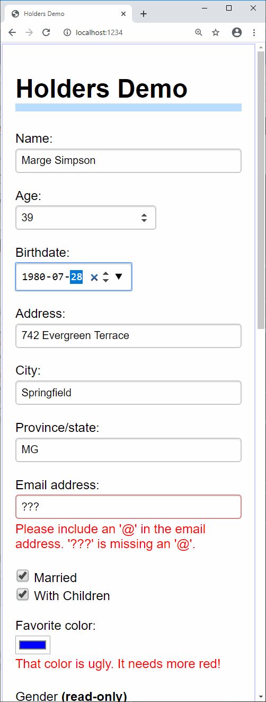

Holders: speak easy to your components
--------------------------------------

React tutorials for beginners teach you to separately send state to child components, and then receive new state back from those child components through an `onChange` handler. For instance if you've written a `Slider` component to edit a numeric value, you might use it like this:

~~~jsx
    <Slider value={this.props.cacheSize} 
            onChange={value => this.props.onCacheSizeChanged(value)} 
            min={-10} max={10} step={1} style={ {width:"12em"} }/>
~~~

And then, whatever code creates _your_ component has to do the same thing again, sending in its own value for `onCacheSizeChanged`.

The *holders* library removes both of these annoyances by bundling the "getter" (`this.props.cacheSize`) together with the "setter" (`value => this.props.onCacheSizeChanged(value)`), in order to simplify communication between components to this:

~~~jsx
    <Slider value={this.props.cacheSize} 
            min={-10} max={10} step={1} style={ {width:"12em"} }/>
~~~

Plus, you don't have to write a `Slider` component - this library already includes it.

The getter/setter bundle is called `Holder<T>`:

    /** A wrapper around a value. */
    export type Holder<T> = {
      readonly get: T;
      set: (newValue: T) => void;
    }

If `cacheSize` is a `Holder<number>` object, `cacheSize.get` returns the current value and `cacheSize.set(v)` is called to update `cacheSize` with a new value. This package includes three kinds of holders, and you add your own as necessary.

This library consists of two very small parts:

1. ['holders'](https://github.com/qwertie/holders/blob/master/holders.ts) is the basic code for creating holder objects, including the `holdValue`, `holdStates`, `holdProps`, and `holdAllProps` functions. This tiny module does not use or need React or JSX.
2. ['elements'](https://github.com/qwertie/holders/blob/master/elements.tsx) provides small React components named `Label`, `TextBox`, `CheckBox`, `DateBox`, etc., which wrap standard forms elements like `<label>`, `<input type="text">`, and `<input type="checkbox">`. Each element can have a label and all standard HTML attributes are supported on each form element. Validation is supported (see below).

It also includes an example (demo.html, demo.tsx, demo.css). It was written in TypeScript, but is published as JavaScript code so it can be used equally well from JavaScript and TypeScript projects. 

To install it in your npm project, run this terminal command: `npm i holders`

Programming should always be this easy
--------------------------------------

This package lets you describe most lines of a form with only 1 to 4 lines of code.

Wide                      |  Narrow                   
:------------------------:|:-------------------------:
             |  

For example, the upper part of this demo, including validation support **and** the underlying model, is described by 38 lines of TypeScript:

~~~tsx
class Model {
  name: string = "";
  birthdate?: Date = undefined; // redundancy: because it's only an example
  address: string = "";
  city: string = "";
  province: string = "";
  email: string = "";
  date?: Date = undefined;
  color: string = "#bbff44";
  married: boolean = false;
  haveChildren: boolean = false;
  error: string;
}

// A simple form
function PersonForm(m: Holders<Model>) {
  let age = asAge(m.birthdate);
  return <form>
    <TextBox p label="Name:"  required value={m.name} autoComplete="name" placeholder="First Last"/>
    <TextBox p label="Age:"            value={age}    type="number"
             parse={text => (age.set(parseFloat(text)), age.get)}/>
    <DateBox p label="Birthdate:"      value={m.birthdate} autoComplete="bday"/>
    <TextBox p label="Address:"        value={m.address}  autoComplete="address-line1"/>
    <TextBox p label="City:"           value={m.city}     autoComplete="address-level2" maxLength={30}/>
    <TextBox p label="Province/state:" value={m.province} autoComplete="address-level1" maxLength={30}/>
    <TextBox p label="Email address:"  value={m.email}  type="email" autoComplete="email"/>
    

      <LabelSpan><CheckBox label="Married"  value={m.married} labelAfter={true}/></LabelSpan>
      {m.married.get ? <CheckBox label="With Children" value={m.haveChildren}/> : undefined}
    

    <ColorPicker p label="Favorite color:" value={m.color}
               error={m.color.get[1] < '9' ? "That color is ugly. It needs more red!" : ""}/>
    <Label p label={Gender <b>(read-only)</b>}>
      <Radio label="Male" value={{get: false}}/>{" "}
      <Radio label="Female" value={{get: true}}/>
    </Label>
  </form>;
}
~~~

This form was clearly designed by an idiot, since there is _both_ an "Age" _and_ a "Birthdate" field. In order to convert ages to dates (and vice versa) we're going to need an adapter. That will require another 19 lines of code:

~~~ts
function asAge(date: Holder<Date|undefined>): Holder<number> {
  const msPerYear = 1000*60*60*24*365.2422; // milliseconds per year
  let age = {
    get get() {
      if (date.get)
        return Math.floor((new Date() as any - (date.get as any)) / msPerYear);
    },
    set(value: number) {
      console.log(value);
      if (!(value === value) || value < 0 || value > 200)
        throw new Error("Invalid age");
      let changeInYears = (age.get || 0) - value;
      let newDate = date.get || new Date();
      newDate.setFullYear(newDate.getFullYear() + changeInYears);
      date.set(newDate);
    }
  };
  return age;
}
~~~

You'll also need some glue to combine the model and view, and here it is:

~~~tsx
function App(props: { model: Model }) {
  const [holders, setHolders] = React.useState(
    holdAllProps(props.model, () => { this.setHolders(holders); })
  );
  return <PersonForm {...holders}/>
}

ReactDOM.render(<App model={new Model()}/>, document.getElementById('app'));
~~~

The built-in holders are not designed for advanced scenarios or hierarchical data. It's on my to-do list to try integrating this with an easy state-management library like MobX (I expect MobX, specifically, to work nicely with this library).

Form elements: design goals
---------------------------

- Be easy and concise to use
- Be small (under 10K minified)
- Be flexible (has global `options`, has various props for customization)
- Be well-documented
- Be minimal but complete. All advanced functionality (e.g. Date input, autocomplete, 
  validation) is offloaded to the browser as much as possible, and styling is left up to 
  CSS (see demo.css for example styling). The browser validation API was designed very 
  badly, though, so this library augments the built-in support.

Validation support
------------------

Your app can provide validation errors in four different ways:

1. The `parse` prop can return or throw a `new Error` to display a message
2. The `value.set` function can throw a `new Error` to display a message
3. You can set the `error` prop to display a message or a JSX element
4. You can set HTML5 validation attributes such as `required` or `pattern`, or use a `type` that has built-in validation behavior provided by the browser (e.g. `<TextBox type="email">`)

If the Holder Forms component is text-based (TextBox or TextArea), it will notify the element that it is invalid using the `setCustomValidity` API, and then you can style it with a selector like `input[type="text"]:invalid`.

Since validation support sucks ass in most browsers, the component produces extra HTML for validation errors. For example, consider this humble component:

~~~tsx
   <TextBox p label="Name:"  required value={m.name} autoComplete="name" placeholder="First Last"/>
~~~

It is marked as `required`, so if you tab out of the component without filling it in, an error will appear. Here's the HTML it produces:

~~~html

  <label>
    Name:
    
      <input required="" autocomplete="name" placeholder="First Last" type="text" value="">
      Please fill out this field.
    
  </label>

~~~

These elements can then be styled, as demoed in the demo. If you need `TextBox` to produce different markup, there are various things you can do. For example, the `noErrorSpan` prop will suppress the error, the `errorFirst` prop will put the error before the `<input>`, and you can replace the entire layout by installing a custom function for `composeElementWithLabel`.

Documentation
-------------

Full doc comments are provided in the source code for ['holders/elements'](https://github.com/qwertie/holders/blob/master/elements.tsx) and ['holders/holders'](https://github.com/qwertie/holders/blob/master/holders.ts).

To run the demo
---------------

Due to [bug #1904](https://github.com/parcel-bundler/parcel/issues/1904) in parcel-bundler, Parcel versions above 1.6.2 don't work.

    npm install --global parcel-bundler@1.6.2
    npm run demo
    
Then visit http://localhost:1234 in browser.

Features
--------

- UMD modules targeting ES5 (old browsers supported)
- Minified size: 2.2K for holders.min.js, 8.1K for elements.min.js
- Includes d.ts files (written in TypeScript)
- Elements are expected to be compatible with Preact as well as React

To Learn More
-------------

This library is part of the [TypeScript-React Primer](http://typescript-react-primer.loyc.net); see [part 5, example 5](http://typescript-react-primer.loyc.net/tutorial-5.html#example-5-simple-forms) to learn more about how to use *holders*.
