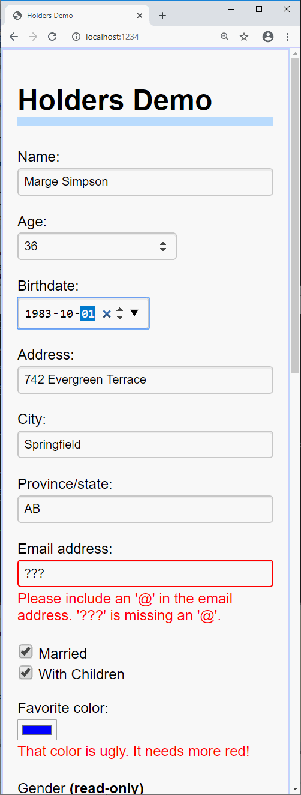

Holders
-------

React tutorials for beginners teach you to separately send state to child components, and then receive new state back from those child components through an `onChange` handler. For instance if you've written a `Slider` component to edit a numeric value, you might use it like this:

~~~jsx
    <Slider value={this.props.cacheSize} 
            onChange={value => this.props.onCacheSizeChanged(value)} 
            min={-10} max={10} step={1} style={ {width:"12em"} }/>
~~~

And then, whatever code creates _your_ component has to do the same thing again, sending in its own value for `onCacheSizeChanged`.

The *holders* library removes both of these annoyances by bundling the "getter" (`this.props.cacheSize`) together with the "setter" (`value => this.props.onCacheSizeChanged(value)`), in order to simplify communication between components to this:

~~~jsx
    <Slider value={this.props.cacheSize} 
            min={-10} max={10} step={1} style={ {width:"12em"} }/>
~~~

Plus, you don't have to write a `Slider` component - this library already includes it.

The getter/setter bundle is called `Holder<T>`

    /** A wrapper around a value. */
    export type Holder<T> = {
      readonly get: T;
      set: (newValue: T) => void;
    }

If `cacheSize` is a `Holder<number>` object, `cacheSize.get` returns the current value and `cacheSize.set(v)` is called to update `cacheSize` with a new value. You can either use one of the three kinds of holders in this library

Although this package was written in TypeScript, it is published as JavaScript code so it can be used equally well from JavaScript and TypeScript projects. 

This library consists of two very small parts:

1. ['holders'](https://github.com/qwertie/holders/blob/master/holders.ts) is the basic code for creating holder objects, including the `holdValue`, `holdStates`, `holdProps`, and `holdAllProps` functions. This tiny module does not use or need React or JSX.
2. ['elements'](https://github.com/qwertie/holders/blob/master/elements.tsx) provides small React components named `Label`, `TextBox`, `CheckBox`, `DateBox`, etc., which wrap standard forms elements like `<label>`, `<input type="text">`, and `<input type="checkbox">`. Each element can have a label and all standard HTML attributes are supported on each form element. Validation is supported via `HTMLInputElement.setCustomValidity()`.

It also includes an example (demo.html, demo.tsx).

To install it in your npm project, run this terminal command: `npm i holders`

Programming should always be this easy
--------------------------------------

This package lets you describe most lines of a form with only 1 to 4 lines of code.

Wide                      |  Narrow                   
:------------------------:|:-------------------------:
             |  

For example, the upper part of this demo and its underlying model is described by 30 lines of TypeScript:

~~~ts
class Model {
  name: string = "";
  age?: number = undefined;
  address: string = "";
  city: string = "";
  province: string = "";
  country: string = "";
  date?: Date = undefined;
  color: string = "#bbff44";
  married: boolean = false;
  haveChildren: boolean = false;
}

// A simple form
function PersonForm(m: Holders<Model>) {
  return <form>
    <TextBox p label="Name:"     value={m.name} autoComplete="name" placeholder="First Last"/>
    <TextBox p label="Age:"      value={m.age}  type="number"
             parse={s => parseFloat(s) || new Error("Invalid age")}/>
    <TextBox p label="Address:"  value={m.address}  autoComplete="address-line1"/>
    <TextBox p label="City:"     value={m.city}     autoComplete="address-level1"/>
    <TextBox p label="Province:" value={m.province} autoComplete="address-level1"/>
    <TextBox p label="Country:"  value={m.country}  autoComplete="country-name"/>
    

      <LabelSpan><CheckBox label="Married"  value={m.married}  labelAfter={true}/></LabelSpan>
      {m.married.get ? <CheckBox label="With Children" value={m.haveChildren}/> : undefined}
    

    <TextBox p label="Favorite color:" value={m.color} type="color"/>
  </form>;
}
~~~

You'll also need some glue to combine the model and view, and here it is:

~~~ts
function App(props: { model: Model }) {
  const [holders, setHolders] = React.useState(
    holdAllProps(props.model, () => { this.setHolders(holders); })
  );
  return <PersonForm {...holders}/>
}

ReactDOM.render(<App model={new Model()}/>, document.getElementById('app'));
~~~

The built-in holders are not designed for advanced scenarios or hierarchical data. It's on my to-do list to try integrating this with an easy state-management library like MobX (I expect MobX, specifically, to work nicely with this library).

To run the demo
---------------

Due to [bug #1904](https://github.com/parcel-bundler/parcel/issues/1904) in parcel-bundler, Parcel versions above 1.6.2 don't work.

    npm install --global parcel-bundler@1.6.2
    npm run demo
    
Then visit http://localhost:1234 in browser.

Features
--------

- UMD modules targeting ES5 (old browsers supported)
- Minified size: 2.2K for holders.min.js, 5.8K for elements.min.js
- Includes d.ts files (written in TypeScript)
- Elements are expected to be compatible with Preact as well as React

To Learn More
-------------

This library is part of the [TypeScript-React Primer](http://typescript-react-primer.loyc.net); see [part 5, example 5](http://typescript-react-primer.loyc.net/tutorial-5.html#example-5-simple-forms) to learn more about how to use *holders*.